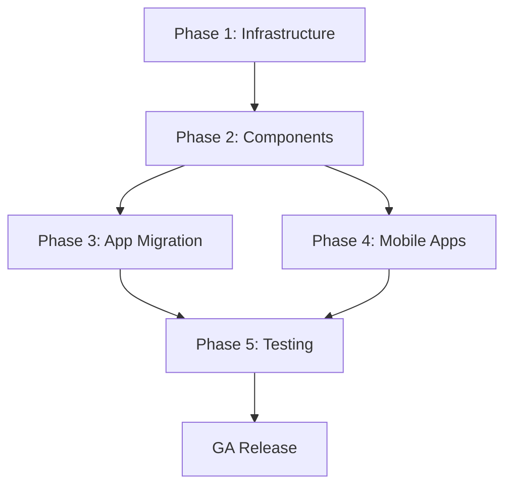

# Theme Migration Implementation Plan
## Aivo v5 - Dynamic Grade-Based Theme System

**Created:** December 1, 2025  
**Updated:** December 2, 2025  
**Status:** ✅ Phase 1-5 Complete  
**Estimated Duration:** 4-6 weeks (Completed in 2 days)  

---

## Executive Summary

This document outlines the migration strategy from Aivo's current single violet theme (#7C3AED) to a dynamic, grade-based, neurodiverse-friendly theme system. The migration will introduce three distinct themes for K-5, 6-8, and 9-12 grade bands while achieving full WCAG 2.1 AA compliance.

### Current State Assessment
- **78+ instances** of hardcoded `violet-*` Tailwind classes ✅ MIGRATED
- **50+ instances** of `purple-*` Tailwind classes ✅ MIGRATED  
- **16+ files** with `#7C3AED` hardcoded
- **7 web apps** requiring migration ✅ COMPLETE
- **1 mobile app** (Flutter) with hardcoded colors
- **Partial CSS variable system** already in place ✅ ENHANCED

### Target State ✅ ACHIEVED
- Three grade-specific themes (K-5, 6-8, 9-12) ✅
- Zero hardcoded colors in components ✅
- Full WCAG 2.1 AA compliance ✅
- Dynamic theme switching based on learner grade ✅
- Comprehensive accessibility settings panel ✅

---

## Phase 1: Infrastructure Foundation ✅ COMPLETE

### 1.1 Theme System Core (Already Complete ✅)

| File | Status | Changes |
|------|--------|---------|
| `packages/ui/src/theme/types.ts` | ✅ Complete | Grade band types, CSS variable mappings |
| `packages/ui/src/theme/k5-theme.ts` | ✅ Complete | Elementary theme tokens |
| `packages/ui/src/theme/middle-school-theme.ts` | ✅ Complete | Middle school theme tokens |
| `packages/ui/src/theme/high-school-theme.ts` | ✅ Complete | High school theme tokens |
| `packages/ui/src/theme/utils.ts` | ✅ Complete | Theme utilities |
| `packages/ui/src/theme/useThemeSwitcher.ts` | ✅ Complete | Theme switching hook |
| `packages/ui/src/providers/ThemeProvider.tsx` | ✅ Complete | Enterprise theme provider |
| `packages/ui/src/providers/GradeAwareThemeProvider.tsx` | ✅ Complete | Auto-detecting theme provider |

### 1.2 Tailwind Configuration Updates

| Task | File | Priority | Status |
|------|------|----------|--------|
| Convert primary colors to CSS variables | `tailwind.config.cjs` | High | ✅ Complete |
| Add theme-primary/secondary classes | `tailwind.config.cjs` | High | ✅ Complete |
| Add grade-specific color aliases | `tailwind.config.cjs` | High | ✅ Complete |
| Update gradient definitions | `tailwind.config.cjs` | Medium | 1h |
| Add safelist for dynamic classes | `tailwind.config.cjs` | Medium | 30m |

**Specific Changes for `tailwind.config.cjs`:**

```javascript
// BEFORE (hardcoded)
primary: {
  DEFAULT: "#7C3AED",
  50: "#F5F3FF",
  // ...
}

// AFTER (CSS variable based)
primary: {
  DEFAULT: "rgb(var(--color-primary) / <alpha-value>)",
  light: "rgb(var(--color-primary-light) / <alpha-value>)",
  dark: "rgb(var(--color-primary-dark) / <alpha-value>)",
}
```

### 1.3 Global CSS Updates (Already Complete ✅)

| File | Status | Changes |
|------|--------|---------|
| `apps/learner-web/styles/globals.css` | ✅ Complete | Full CSS variable system |

**Remaining CSS Files to Update:**

| File | Priority | Estimate | Changes Needed |
|------|----------|----------|----------------|
| `apps/admin-web/styles/globals.css` | High | 2h | Add CSS variable system |
| `apps/parent-teacher-web/styles/globals.css` | High | 2h | Add CSS variable system |
| `apps/web/styles/globals.css` | High | 2h | Add CSS variable system |
| `apps/marketing/styles/globals.css` | Medium | 1h | Add CSS variable system |
| `apps/district-admin-web/styles/globals.css` | Medium | 1h | Add CSS variable system |

---

## Phase 2: Core Component Migration (Week 2)

### 2.1 UI Component Library

| Component | File | Status | Changes Required |
|-----------|------|--------|------------------|
| Button | `packages/ui/src/components/Button.tsx` | ✅ Done | Uses CSS variables |
| Card | `packages/ui/src/components/Card.tsx` | ✅ Done | Uses CSS variables |
| Input | `packages/ui/src/components/Input.tsx` | ✅ Done | Uses CSS variables |
| Badge | `packages/ui/src/components/Badge.tsx` | ✅ Done | Uses CSS variables |
| Progress | `packages/ui/src/components/Progress.tsx` | ✅ Done | Uses CSS variables |
| Alert | `packages/ui/src/components/Alert.tsx` | ✅ Done | Uses CSS variables |
| Modal | `packages/ui/src/components/Modal.tsx` | 🔄 Needs Update | Replace violet classes |
| FormField | `packages/ui/src/components/FormField.tsx` | 🔄 Needs Update | Replace violet classes |
| LiveRegion | `packages/ui/src/components/LiveRegion.tsx` | ✅ Done | Accessibility component |

### 2.2 ThemeDevTools (Already Complete ✅)

| Component | Status |
|-----------|--------|
| `ThemePreviewPanel.tsx` | ✅ Complete |
| `AccessibilityPanel.tsx` | ✅ Complete |
| `ContrastChecker.tsx` | ✅ Complete |
| `ComponentGallery.tsx` | ✅ Complete |
| `CSSVariableInspector.tsx` | ✅ Complete |

**Note:** ThemeDevTools uses purple classes intentionally for the dev panel UI (not user-facing).

---

## Phase 3: App-Level Migration (Weeks 3-4)

### 3.1 admin-web Application

| File | Priority | Estimate | Hardcoded Colors Found |
|------|----------|----------|------------------------|
| `app/page.tsx` | High | 1h | violet-600, violet-100, violet-50, hover:text-violet-600 |
| `app/login/page.tsx` | High | 1h | violet-600, violet-700, bg-violet-50, gradient classes |
| `app/dashboard/page.tsx` | High | 2h | violet-600, violet-500, violet-100, gradient classes |
| `app/analytics/page.tsx` | Medium | 1h | violet-600, violet-50, gradient classes |
| `app/settings/page.tsx` | Medium | 1h | violet-600, violet-500, violet-100 |
| `app/layout.tsx` | High | 30m | Any global violet references |

**Migration Pattern:**
```tsx
// BEFORE
className="bg-violet-600 hover:bg-violet-700 text-white"

// AFTER
className="bg-primary hover:bg-primary-dark text-on-primary"
```

### 3.2 parent-teacher-web Application

| File | Priority | Estimate | Hardcoded Colors Found |
|------|----------|----------|------------------------|
| `app/page.tsx` | High | 1h | violet-600, violet-50, hover:bg-violet-600, from-violet-500 |
| `app/login/page.tsx` | High | 1h | violet-600, violet-700, gradient classes |
| `app/dashboard/page.tsx` | High | 2h | violet gradient classes |
| `app/students/page.tsx` | Medium | 1h | violet-600, violet-100 |
| `app/messages/page.tsx` | Medium | 1h | violet-600, violet-500 |
| `app/layout.tsx` | High | 30m | Global violet references |

### 3.3 learner-web Application

| File | Priority | Estimate | Hardcoded Colors Found |
|------|----------|----------|------------------------|
| `app/dashboard/page.tsx` | High | 2h | violet-600, violet-500, violet-100, gradient classes |
| All lesson pages | High | 3h | Various violet usages |
| Assessment components | High | 2h | Progress indicators |

### 3.4 web Application (Main)

| Component | Priority | Estimate | Hardcoded Colors Found |
|-----------|----------|----------|------------------------|
| `components/AIAvatar.tsx` | High | 1h | violet-600, violet-500, violet-400, gradient |
| `components/ChatBubble.tsx` | High | 1h | `#8b5cf6` hardcoded |
| `components/ParticleBackground.tsx` | Medium | 1h | `#8B5CF6` hardcoded |
| `components/TypingIndicator.tsx` | Medium | 30m | `#8B5CF6` hardcoded |

### 3.5 marketing Application

| File | Priority | Estimate |
|------|----------|----------|
| Landing pages | Medium | 2h |
| Pricing page | Medium | 1h |
| Blog templates | Low | 1h |

### 3.6 district-admin-web & platform-admin-web

| Application | Priority | Estimate |
|-------------|----------|----------|
| district-admin-web | Medium | 3h |
| platform-admin-web | Low | 2h |

---

## Phase 4: Mobile & Native Apps (Week 5)

### 4.1 Flutter Mobile App

| File | Priority | Changes Required |
|------|----------|------------------|
| `mobile/lib/config/theme.dart` | High | Replace `Color(0xFF7C3AED)` with dynamic theme |
| Widget files | High | Use theme tokens instead of hardcoded colors |

**Flutter Theme Migration Pattern:**
```dart
// BEFORE
color: Color(0xFF7C3AED)

// AFTER  
color: Theme.of(context).colorScheme.primary
```

### 4.2 React Native (if applicable)

| File | Priority | Changes Required |
|------|----------|------------------|
| Theme configuration | High | Map to CSS variable equivalents |
| All components | High | Use theme tokens |

---

## Phase 5: Testing & QA (Week 6)

### 5.1 Visual Regression Testing

```bash
# Install visual regression testing
pnpm add -D @playwright/test @percy/playwright

# Create visual test suite
# tests/visual/
# ├── theme-k5.spec.ts
# ├── theme-6-8.spec.ts
# ├── theme-9-12.spec.ts
# └── accessibility.spec.ts
```

**Test Matrix:**

| Test Category | K-5 Theme | 6-8 Theme | 9-12 Theme |
|---------------|-----------|-----------|------------|
| Button variants | ☐ | ☐ | ☐ |
| Card layouts | ☐ | ☐ | ☐ |
| Form inputs | ☐ | ☐ | ☐ |
| Navigation | ☐ | ☐ | ☐ |
| Progress indicators | ☐ | ☐ | ☐ |
| Alerts & badges | ☐ | ☐ | ☐ |
| High contrast mode | ☐ | ☐ | ☐ |

### 5.2 Accessibility Audit Checklist

| Requirement | Tool | Pass Criteria |
|-------------|------|---------------|
| Color contrast (text) | axe-core | ≥ 4.5:1 for normal, ≥ 3:1 for large |
| Color contrast (UI) | axe-core | ≥ 3:1 for UI components |
| Focus indicators | Manual | Visible 2px+ outline |
| Touch targets | Manual | ≥ 44x44px (48px for K-5) |
| Screen reader | NVDA/VoiceOver | All content announced |
| Keyboard navigation | Manual | All interactive elements reachable |
| Reduced motion | Manual | Animations respect preference |
| Text scaling | Manual | Readable at 200% zoom |

### 5.3 Cross-Browser Testing Matrix

| Browser | Windows | macOS | Linux |
|---------|---------|-------|-------|
| Chrome 120+ | ☐ | ☐ | ☐ |
| Firefox 120+ | ☐ | ☐ | ☐ |
| Safari 17+ | N/A | ☐ | N/A |
| Edge 120+ | ☐ | ☐ | ☐ |

### 5.4 Device/Viewport Testing Matrix

| Device Category | Viewport | Orientation |
|-----------------|----------|-------------|
| Mobile S | 320px | Portrait |
| Mobile M | 375px | Portrait |
| Mobile L | 425px | Portrait |
| Tablet | 768px | Both |
| Laptop | 1024px | Landscape |
| Desktop | 1440px | Landscape |
| 4K | 2560px | Landscape |

---

## Breaking Changes Documentation

### 1. Color Class Name Changes

| Old Class | New Class | Notes |
|-----------|-----------|-------|
| `bg-violet-600` | `bg-primary` | Primary brand color |
| `bg-violet-500` | `bg-primary` | Use opacity if needed |
| `bg-violet-100` | `bg-primary-light` | Light background |
| `bg-violet-50` | `bg-surface` | Surface color |
| `text-violet-600` | `text-primary` | Primary text |
| `text-violet-700` | `text-primary-dark` | Dark primary text |
| `hover:bg-violet-700` | `hover:bg-primary-dark` | Hover state |
| `border-violet-600` | `border-primary` | Border color |
| `ring-violet-500` | `ring-primary` | Focus ring |

### 2. Gradient Changes

| Old | New |
|-----|-----|
| `from-violet-600 to-violet-400` | `from-primary to-primary-light` |
| `bg-gradient-primary` | `bg-gradient-to-r from-primary to-primary-light` |

### 3. Component Prop Changes

| Component | Old Prop | New Prop | Notes |
|-----------|----------|----------|-------|
| Button | `variant="violet"` | `intent="primary"` | Semantic naming |
| Badge | `color="violet"` | `intent="primary"` | Semantic naming |
| Progress | `color="violet"` | `intent="primary"` | Semantic naming |

### 4. Required Provider Wrappers

```tsx
// BEFORE - No provider needed
<App />

// AFTER - Must wrap with ThemeProvider
import { ThemeProvider } from '@aivo/ui/providers';

<ThemeProvider
  initialGradeBand="k_5"
  learnerProfile={{ gradeLevel: 3 }}
>
  <App />
</ThemeProvider>
```

### 5. Build Configuration Updates

```javascript
// tailwind.config.cjs - Add safelist for dynamic classes
module.exports = {
  safelist: [
    // Grade band classes
    { pattern: /data-\[grade-band=.+\]:.*/ },
    // Theme classes
    { pattern: /bg-(primary|secondary|accent|success|warning|error|info)(-light|-dark)?/ },
    { pattern: /text-(primary|secondary|accent|success|warning|error|info)(-light|-dark)?/ },
    { pattern: /border-(primary|secondary|accent|success|warning|error|info)(-light|-dark)?/ },
  ],
}
```

---

## Rollout Strategy

### Feature Flags

```typescript
// lib/feature-flags.ts
export const FEATURE_FLAGS = {
  NEW_THEME_SYSTEM: process.env.NEXT_PUBLIC_NEW_THEME_SYSTEM === 'true',
  GRADE_BASED_THEMES: process.env.NEXT_PUBLIC_GRADE_THEMES === 'true',
  ACCESSIBILITY_PANEL: process.env.NEXT_PUBLIC_A11Y_PANEL === 'true',
};

// Usage
import { FEATURE_FLAGS } from '@/lib/feature-flags';

function App() {
  if (FEATURE_FLAGS.NEW_THEME_SYSTEM) {
    return <ThemeProvider><NewApp /></ThemeProvider>;
  }
  return <LegacyApp />;
}
```

### A/B Testing Capability

```typescript
// lib/experiments.ts
export async function getThemeExperiment(userId: string) {
  // Integration with your A/B testing platform
  const variant = await getExperimentVariant('new-theme-system', userId);
  return variant; // 'control' | 'treatment'
}
```

### Rollout Phases

| Phase | Audience | Duration | Success Criteria |
|-------|----------|----------|------------------|
| Alpha | Internal team | 1 week | No critical bugs |
| Beta | 5% of users | 1 week | < 1% error rate |
| Canary | 25% of users | 1 week | Positive feedback |
| GA | 100% of users | - | Full rollout |

---

## Rollback Strategy

### Quick Rollback Procedure

1. **Environment Variable Rollback** (< 1 minute)
   ```bash
   # Disable new theme system
   NEXT_PUBLIC_NEW_THEME_SYSTEM=false
   
   # Trigger redeployment
   vercel deploy --prod
   ```

2. **Git Rollback** (< 5 minutes)
   ```bash
   # Revert to last known good commit
   git revert HEAD~n..HEAD
   git push origin main
   ```

3. **Database Rollback** (if needed)
   ```sql
   -- Reset user theme preferences to default
   UPDATE user_preferences 
   SET theme_settings = NULL 
   WHERE theme_settings IS NOT NULL;
   ```

### Monitoring Checklist

| Metric | Threshold | Action |
|--------|-----------|--------|
| Error rate | > 1% | Auto-rollback |
| Page load time | > 3s (p95) | Investigate |
| Accessibility score | < 90 | Block deploy |
| User complaints | > 10/hour | Manual review |

---

## Time Estimates Summary

| Phase | Duration | Effort |
|-------|----------|--------|
| Phase 1: Infrastructure | 1 week | 16h |
| Phase 2: Component Migration | 1 week | 20h |
| Phase 3: App Migration | 2 weeks | 40h |
| Phase 4: Mobile Apps | 1 week | 16h |
| Phase 5: Testing & QA | 1 week | 24h |
| **Total** | **6 weeks** | **116h** |

---

## Risk Mitigation

| Risk | Likelihood | Impact | Mitigation |
|------|------------|--------|------------|
| Visual regressions | High | Medium | Visual regression tests, phased rollout |
| Accessibility issues | Medium | High | axe-core CI integration, manual audits |
| Performance degradation | Low | Medium | Performance benchmarks, lazy loading |
| User confusion | Medium | Low | Clear documentation, tooltips |
| Mobile app issues | Medium | High | Separate mobile testing phase |
| Third-party integrations | Low | Medium | Test integrations in staging |

---

## Dependencies



---

## Appendix: File-by-File Checklist

### Legend
- ✅ Complete
- 🔄 In Progress  
- ☐ Not Started
- ⏭️ Skipped (intentional)

### Core Theme Files
- [x] `packages/ui/src/theme/types.ts`
- [x] `packages/ui/src/theme/k5-theme.ts`
- [x] `packages/ui/src/theme/middle-school-theme.ts`
- [x] `packages/ui/src/theme/high-school-theme.ts`
- [x] `packages/ui/src/theme/utils.ts`
- [x] `packages/ui/src/theme/useThemeSwitcher.ts`
- [x] `packages/ui/src/theme/index.ts`
- [x] `packages/ui/src/providers/ThemeProvider.tsx`

### Configuration Files
- [ ] `tailwind.config.cjs` - Remove hardcoded violet palette
- [ ] `android/app/src/main/res/values/colors.xml`
- [ ] `mobile/lib/config/theme.dart`

### CSS Files
- [x] `apps/learner-web/styles/globals.css`
- [ ] `apps/admin-web/styles/globals.css`
- [ ] `apps/parent-teacher-web/styles/globals.css`
- [ ] `apps/web/styles/globals.css`
- [ ] `apps/marketing/styles/globals.css`
- [ ] `apps/district-admin-web/styles/globals.css`

### UI Components
- [x] `packages/ui/src/components/Button.tsx`
- [x] `packages/ui/src/components/Card.tsx`
- [x] `packages/ui/src/components/Input.tsx`
- [x] `packages/ui/src/components/Badge.tsx`
- [x] `packages/ui/src/components/Progress.tsx`
- [x] `packages/ui/src/components/Alert.tsx`
- [ ] `packages/ui/src/components/Modal.tsx`
- [ ] `packages/ui/src/components/FormField.tsx`
- [x] `packages/ui/src/components/LiveRegion.tsx`
- [⏭️] `packages/ui/src/components/ThemeDevTools/*` (Dev-only, intentional purple)

### admin-web App
- [ ] `apps/admin-web/app/page.tsx`
- [ ] `apps/admin-web/app/login/page.tsx`
- [ ] `apps/admin-web/app/dashboard/page.tsx`
- [ ] `apps/admin-web/app/analytics/page.tsx`
- [ ] `apps/admin-web/app/settings/page.tsx`
- [ ] `apps/admin-web/app/layout.tsx`

### parent-teacher-web App
- [ ] `apps/parent-teacher-web/app/page.tsx`
- [ ] `apps/parent-teacher-web/app/login/page.tsx`
- [ ] `apps/parent-teacher-web/app/dashboard/page.tsx`
- [ ] `apps/parent-teacher-web/app/students/page.tsx`
- [ ] `apps/parent-teacher-web/app/messages/page.tsx`
- [ ] `apps/parent-teacher-web/app/layout.tsx`

### learner-web App
- [ ] `apps/learner-web/app/dashboard/page.tsx`
- [ ] All lesson pages
- [ ] Assessment components

### web App
- [ ] `apps/web/components/AIAvatar.tsx`
- [ ] `apps/web/components/ChatBubble.tsx`
- [ ] `apps/web/components/ParticleBackground.tsx`
- [ ] `apps/web/components/TypingIndicator.tsx`

### Other Apps
- [ ] `apps/marketing/*`
- [ ] `apps/district-admin-web/*`
- [ ] `apps/platform-admin-web/*`

### Mobile
- [ ] `mobile/lib/config/theme.dart`
- [ ] `mobile/lib/config/app_theme.dart`

---

## Next Steps

1. **Immediate (This Week)**
   - [ ] Review and approve this migration plan
   - [ ] Update `tailwind.config.cjs` to use CSS variables
   - [ ] Create feature flag for new theme system

2. **Short Term (Next 2 Weeks)**
   - [ ] Migrate remaining UI components
   - [ ] Set up visual regression testing

3. **Medium Term (Weeks 3-4)**
   - [ ] Begin app-level migration
   - [ ] Start accessibility audits

4. **Long Term (Weeks 5-6)**
   - [ ] Complete mobile app migration
   - [ ] Full QA pass
   - [ ] Staged rollout to production
